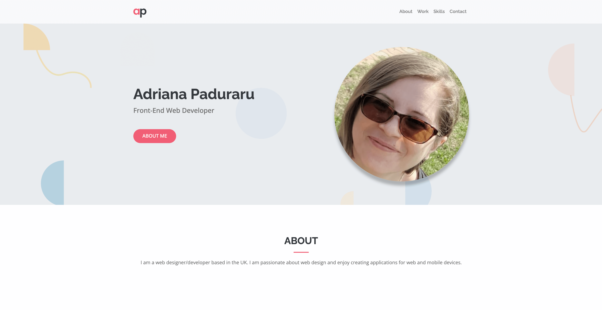

# Bootstrap Portfolio page

## Description

This portfolio page has been created to showcase projects and skills by using Bootstrap.

## Installation

N/A

## Usage

[Demo URL](https://celiyo.github.io/bootstrap-portfolio/)

1. Using Bootstrap, recreate your portfolio site with the following items:
   - A navigation bar
   - A navigation menu at the top. Feel free to use Bootstrap's navbar or create your own.
   - A hero section
   - A work section
   - A skills section
   - An about/contact section
   - A footer section
2. Your Bootstrap solution should minimize use of media queries.
3. Deploy your new Bootstrap-powered portfolio to GitHub Pages.

## Credits

N/A

## License

Please refer to the LICENSE in the repo.
